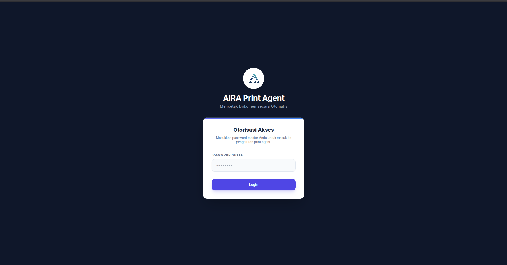
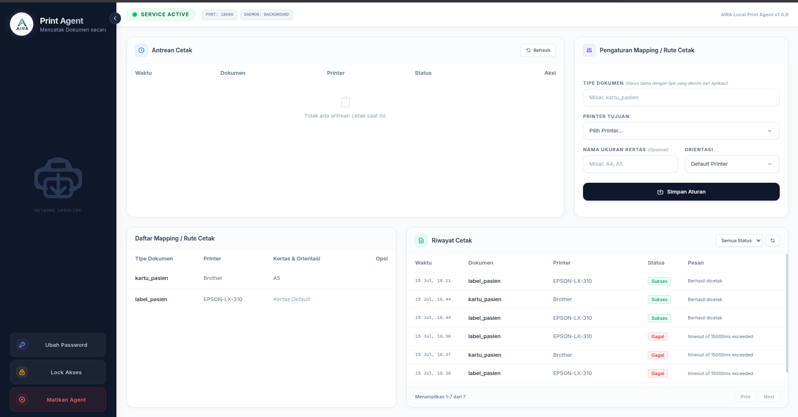

# AIRA Print Agent

**Mencetak Dokumen secara Otomatis**

AIRA Print Agent adalah aplikasi _background service_ (agen lokal) berbasis Node.js yang berfungsi sebagai jembatan (_bridge_) antara aplikasi web dan printer fisik lokal. Aplikasi ini memungkinkan sistem berbasis web untuk mencetak dokumen (PDF, struk, label, dll.) secara langsung dan otomatis (_silent print_) ke printer yang terhubung ke komputer pengguna, tanpa memunculkan dialog print bawaan browser.

## ✨ Fitur Utama

- **Silent Printing**: Cetak otomatis di latar belakang tanpa intervensi pengguna (tanpa popup print browser).
- **Cross-Platform**: Mendukung penuh sistem operasi Windows dan Linux.
- **Dynamic Routing & Mapping**: Menentukan printer tujuan, ukuran kertas kustom, dan orientasi (Portrait/Landscape) berdasarkan _tipe dokumen_ (misal: `kartu_pasien` ke Printer A ukuran A5, `struk_kasir` ke Printer B ukuran Thermal).
- **Auto-Scaling / Fit to Paper**: Menggunakan algoritma _shrink-to-fit_ untuk memastikan dokumen tercetak sempurna tanpa terpotong.
- **Pengaturan Lanjutan (Advanced)**: Mendukung kustomisasi Margin, Zoom, dan Orientasi dokumen langsung melalui Dashboard Agent.
- **Sequential Print Queue**: Sistem antrean bawaan (Queue) yang mencegah _blocking_ atau _deadlock_ saat menerima permintaan masal, khususnya bagi backend berjenis _single-thread_ (seperti `php artisan serve`).
- **Local Dashboard**: Antarmuka web lokal yang bersih (berbasis Tailwind CSS) untuk mengatur _mapping_ printer dan memonitor riwayat cetak.
- **Keamanan Terpusat**: Akses ke dashboard lokal dilindungi oleh sistem Autentikasi/Password lokal.
- **Standalone Executable**: Dapat dikompilasi menjadi file `.exe` tunggal (tanpa perlu install Node.js di komputer klien) menggunakan `pkg`.
- **Auto Versioning**: Sistem kompilasi cerdas (`build.js`) yang otomatis menaikkan angka versi aplikasi dan memperbarui dashboard saat proses _build_ dijalankan.

## 🛠️ Teknologi yang Digunakan

- **Backend**: Node.js, Express.js
- **Database**: LowDB (Local JSON Database untuk menyimpan konfigurasi dan log)
- **Frontend Dashboard**: HTML5, Vanilla JavaScript, Tailwind CSS
- **Printing Engine**: `pdf-to-printer` (Windows via SumatraPDF) & `unix-print` / `lp` command (Linux/CUPS)
- **Bundler**: `pkg`

## 🚀 Cara Instalasi & Penggunaan

### 1. Menjalankan dari Source Code (Development)

Pastikan Node.js (versi 16+) sudah terinstal di komputer Anda.

```bash
# Clone repositori
git clone https://github.com/username/aira-print-agent.git
cd aira-print-agent

# Install dependencies
npm install

# Jalankan server
node server.js
```

Agent akan berjalan di latar belakang pada `http://localhost:18080`.
Buka browser dan akses URL tersebut untuk membuka Dashboard Konfigurasi.

### 2. Menggunakan Versi Executable (Production / Client)

Untuk kemudahan distribusi di komputer klien (tanpa install Node), Anda dapat membangun file _executable_.

```bash
# Install pkg secara global (sekali saja)
npm install -g pkg

# Jalankan script build (akan otomatis menaikkan versi dan mengkompilasi executable)
node build.js
```

Hasil build akan berada di dalam folder `dist/`. Anda cukup menyalin file `AIRA-Print-Agent.exe` ke komputer klien dan menjalankannya (bisa dimasukkan ke dalam folder _Startup_ Windows agar berjalan otomatis saat komputer menyala).

## 🔌 API Documentation (Untuk Integrasi Web App)

Aplikasi web Anda (Angular, React, Vue, Laravel, dll) hanya perlu mengirimkan HTTP POST request ke Local Print Agent yang berjalan di komputer klien (`http://localhost:18080`).

**Endpoint:** `POST http://localhost:18080/print`

**Payload (JSON):**

```json
{
  "url": "http://domain-anda.com/api/print/dokumen.pdf",
  "type": "kartu_pasien",
  "printerName": "Epson L3110" 
}
```

_Catatan:_

- `url`: Harus berisi link absolut yang mengembalikan file biner PDF.
- `type`: Tipe dokumen ini harus sudah didaftarkan pada Dashboard Local Print Agent (menu _Mapping/Rute Cetak_).
- `printerName` (opsional): Jika Anda ingin mem-_bypass_ mapping dashboard dan langsung menunjuk nama printer spesifik dari aplikasi Anda.
- **Penting:** Jika Anda mengatur Ukuran Kertas (_Paper Size_), Orientasi, **Margin**, atau **Zoom** pada Dashboard, Print Agent akan otomatis menyisipkannya sebagai _query parameter_ ke dalam URL ini (contoh: `?paperSize=A5&orientation=landscape&margin=10mm%2010mm%2010mm%2010mm&zoom=80`). Aplikasi backend Anda dapat menangkap parameter ini untuk menghasilkan ukuran PDF yang dinamis sesuai pengaturan.

### Mendapatkan Daftar Printer dari OS Lokal

**Endpoint:** `GET http://localhost:18080/printers`

_Response:_
```json
{
  "success": true,
  "printers": [
    { "name": "Epson L3110" },
    { "name": "Microsoft Print to PDF" }
  ]
}
```
API ini sangat berguna jika Anda ingin menampilkan daftar *dropdown* printer langsung di dalam aplikasi Web/Angular Anda.

**Contoh Integrasi di Frontend (JavaScript/Fetch):**

```javascript
fetch("http://127.0.0.1:18080/print", {
  method: "POST",
  headers: { "Content-Type": "application/json" },
  body: JSON.stringify({
    url: "http://domain-anda.local/api/cetak/kartu?id=123",
    type: "kartu_pasien",
  }),
})
  .then((res) => {
    if (res.ok) console.log("Berhasil dikirim ke Print Agent!");
  })
  .catch((err) => {
    console.error(
      "Print Agent tidak merespon (Offline). Fallback ke mode print browser standar.",
    );
    window.open("http://domain-anda.local/api/cetak/kartu?id=123", "_blank");
  });
```

**Contoh Penanganan di Backend (PHP/Laravel):**

Saat menerima _request_ dari Print Agent untuk mengunduh PDF, aplikasi _backend_ Anda dapat menangkap parameter ukuran kertas dan orientasi untuk membangun PDF yang dinamis (contoh menggunakan library `dompdf`):

```php
// Menangkap query parameter yang disisipkan oleh Print Agent
$reqPaper = $request->input('paperSize');
$reqOri = $request->input('orientation');

// Menggunakan nilai default jika parameter tidak dikirim
$paperSize = !empty($reqPaper) ? strtolower($reqPaper) : 'a4';
$orientation = !empty($reqOri) ? strtolower($reqOri) : 'portrait';

// Generate PDF dengan ukuran & orientasi dinamis
$pdf = \PDF::loadView('template.dokumen', $data);
$pdf->setPaper($paperSize, $orientation);

return $pdf->stream('dokumen.pdf');
```

**Menangani Parameter Zoom & Margin di Blade (HTML to PDF):**
Jika Anda menggunakan fitur Zoom dan Margin pada Print Agent, Anda dapat mengaturnya lewat CSS sebaris pada template HTML Anda:
```html
<style>
  @if(request('margin'))
  @page {
      margin: {{ request('margin') }} !important;
  }
  @endif
</style>
<body style="background:#fff; margin:0; @if(request('zoom')) zoom: {{request('zoom')}}%; transform: scale({{request('zoom')/100}}); transform-origin: top center; @endif">
    <!-- Konten Dokumen Anda -->
</body>
```

## ⚙️ Konfigurasi Kertas Khusus (Custom Paper Size)

Jika Anda menggunakan ukuran kertas yang tidak standar:

1. Buat ukuran kertas baru melalui **Print Server Properties** (Windows) atau **CUPS** (Linux).
2. Catat _Nama Ukuran Kertas_ tersebut persis sama (Case Sensitive).
3. Buka Dashboard Print Agent (`localhost:18080`), masukkan nama kertas tersebut pada form "Mapping Rute Cetak".

## 🤝 Kontribusi

Kontribusi selalu diterima! Jika Anda menemukan bug atau memiliki ide fitur baru:

1. Fork repositori ini
2. Buat branch fitur Anda (`git checkout -b fitur-baru`)
3. Commit perubahan Anda (`git commit -m 'Menambahkan fitur baru'`)
4. Push ke branch (`git push origin fitur-baru`)
5. Buat Pull Request

## 💡 Inspirasi (Acknowledgements)

Proyek ini terinspirasi dari arsitektur aplikasi **[QZ Tray](https://qz.io/)**. Kami sangat mengagumi konsep mereka dalam menghubungkan aplikasi web ke hardware lokal. AIRA Print Agent dibangun sebagai alternatif _open-source_, terfokus khusus pada pencetakan PDF/dokumen senyap (_silent print_), tanpa memerlukan dependensi Java, serta menyediakan antarmuka dashboard manajemen cetak lokal.

## 📄 Lisensi (LICENSE)

Proyek ini dilisensikan di bawah [MIT License](LICENSE). Anda bebas menggunakannya untuk proyek pribadi maupun komersial.

Mohon cantumkan Nama Kami (AIRA Print Agent by AIRA Soft) Jika Anda menggunakan project ini untuk kebutuhan komersial.
Terima kasih atas kerja samanya dan dukungan anda

## Berikan dukungan dan Bintang (Star) pada Repository Ini

Jika anda merasa terbantu dengan adanya aplikasi ini, jangan lupa untuk memberikan dukungan kepada kami dengan cara memberikan bintang (Star) pada repository ini.

Aplikasi ini menghemat banyak waktu dan membantu proyek anda ? Yuk, dukung terus pengembangan open-source ini dengan mentraktir kami! Apresiasi sekecil apapun akan sangat menjadi semangat bagi kami untuk terus berkarya.

- [saweria](https://saweria.co/imanahmadb)

## Support Kami

Untuk support atau pertanyaan terkait project ini, silahkan hubungi kami melalui:

- Email: [imanahmadbunyamin19@gmail.com]

## Screenshot:




